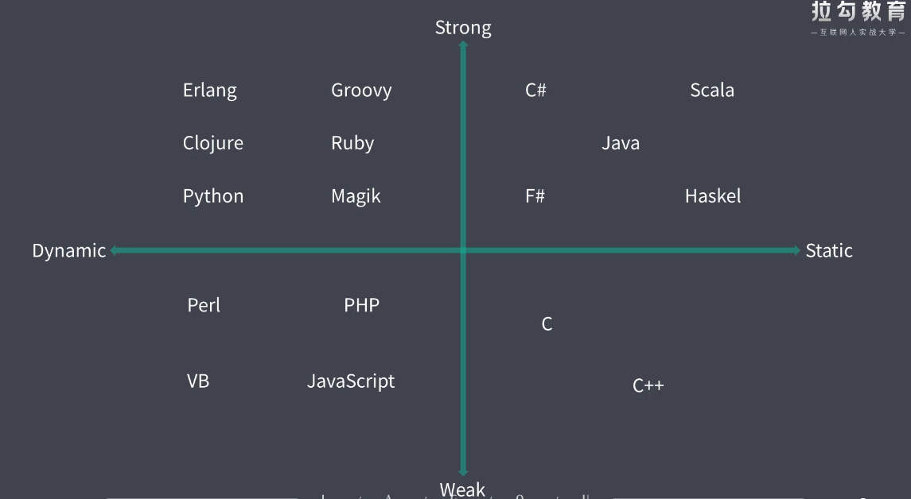

# ECMAScript

ES提供最基本语法，是一套语言标准，是js语言本身

js实现了这一套语言标准，同时根据环境不同会有一定扩展

**ES2015**之后以发布年份命名，通常6月份发布当年标准

ES6特指ES2015，同时习惯使用**ES6**泛指2015之后的新版本

## ES2015

### 解决原有语法问题或不足

#### 增加块级作用域

let，const声明只在块中生效

```js
// 闭包其实是创造函数作用域来隔绝内外层
for (var i = 0; i < 3; i++) {
    // elem[i].onclick = function (i) { console.log(i) }
    elem[i].onclick = (function (i) {
        return function () {
            console.log(i)
        }
    })(i)
}
// for中其实有两层作用域，for语句单独一层作用域，故两个i声明不会冲突
for (let i=0; i++; i<3) {
    let i = 'foo';
}
```

#### 去除变量名提升

let，const必须先声明后使用

### 对原有语法的增强

#### 数组对象解构

```ts
const arr = [1,2,3]
const [a, b, c] = arr; // 1, 2, 3
const [, b, ...c] = arr // 2, [3]
const [, , c, d, e = 5] // 3, undefined, 5

const obj = { a: 'a', b: 'b' }
const { a } = obj // 'a'
const a = 'aa';
const { a: objA, c: objC = 'c' } = obj // objA = 'a', objC = 'c'
// const { a: objA, c: objC = 'c' }: { objA: any, objC: any } = obj
```

#### 模板字符串

```js
const a = 'a'
`转义\`
支持多行
${a}`
// => `\na
```

#### 模板字符串标签函数

```js
// 即对模板字符串可以不加括号调用函数的特殊语法
const a = 'a'
const b = 'b';
function tagFn(stirngs, a, b, c) {
    console.log(strings, a, b, c);
}
tagFn`hello ${a} and ${b}.`
// => ['hello ', ' and ', '.'], a, b, undefined
```

#### 字符串方法

includes, startsWith, endsWith

#### 参数默认值，剩余参数

```ts
function foo (arg) {
    arg = typeof arg === 'undefined' ? defaultValue : arg
    // 不能使用短路运算符，arg = false 也会使用default
}
function foo (arg1 = false, arg2 = arg1 ? 1 : 2, arg3, ...args) { }
// 默认参数值从左向右求值，即可使用之前的参数值
// 没有默认值的参数默认为undefined
// 剩余参数必须在最后
```

### 全新对象，方法，功能

#### 展开数组

```js
const arr = [1,2,3]
console.log(...arr) // 1 2 3
```

#### 箭头函数

普通函数完整调用视为`obj.a.fn(arg) === obj.a.fn.apply(obj.a, arg)`,this在调用时指定

箭头函数this不变，为声明时作用域内this，可理解为普通函数bind

```js
const obj = {
    a: function(){ console.log(this ) },
    b: () => console.log(this)
}
obj.a() // obj
const oa = obj.a; oa() // global
obj.b() // global
const ob = obj.b; ob() // global
```
```js
class inst {
    constructor() {
        this.a1 = function () { console.log(this); }
        this.b1 = () => console.log(this);
    }
    a2() {
        console.log(this)
    }
    get b2() {
        return () => console.log(this);
    }

    static a3() {
        console.log(this)
    } 
    static get b3() {
        return () => console.log(this);
    }
}

const i = new inst();
i.a1() // i
const a1 = i.a1; a1() // undefined
i.b1() // i
const b1 = i.b1; b1() // i

i.a2() // i
const a2 = i.a2; a2() // undefined
i.b2() // i
const b2 = i.b2; b2() // i

inst.a3() // [Function: inst]
const a3 = inst.a3; a3() // undefined
inst.b3() // [Function: inst]
const b3 = inst.b3; b3() // [Function: inst]
```

```js
function inst2() {
    this.a1 = function () {
        console.log(this);
    }
    this.b1 = () => console.log(this);
}
inst2.prototype.a2 = function () { console.log(this); }
inst2.prototype.b2 = () => console.log(this);
inst2.a3 = function () { console.log(this); }
inst2.b3 = () => console.log(this);

const i2 = new inst2();
i2.a1() // i2
const a1 = i2.a1; a1() // global
i2.b1() // i2
const b1 = i2.b1; b1() // i2

i2.a2() // i2
const a2 = i2.a2; a2() // global
i2.b2() // global
const b2 = i2.b2; b2() // global

inst2.a3() // function inst2() { ... }
const a3 = inst2.a3; a3() // global
inst2.b3() // global
const b3 = inst2.b3; b3() // global
```

```js
var num = 20
const obj = {
  num: 10,
  func: num => {
    this.num += 5 // 25, window.num
    console.log(this.num)

    num += 5 // 45, scoped num, init by param
    console.log(num)
    var num = 30 // 30, scoped num, assigned
    console.log(num)

    return function () {
      this.num += 4 // 29, window.num
      console.log(this.num)

      num += 10 // 40, scoped num
      console.log(num)
    }
  }
}
obj.func(40)()
```


#### 对象字面量增强

```js
const obj = {
    prop, // 省略 : prop
    fn() {}, // 省略 : function, 箭头函数还是需要冒号
    [Math.random()]: 'a' // 计算属性名，表达式的值作为key
}
```

#### generator

```js
// 惰性执行，yield直接返回，下次next继续执行下一语句，适合用于迭代器实现
function * foo() {
    yield 1;
    const re = yield 2;
    console.log(re)
    yield 3;
}
const generator = foo()
generator.next() // { value: 1, done: false }
generator.next('next arg') // { value: 2, done: false }, log next arg
generator.next() // { value: 3, done: false }
generator.next() // { value: undefined, done: true }
```

`generator.throw`会在上次yield位置抛出异常

#### for...of，iterator

只能遍历iterable属性，如数组，伪数组（arguments），Set，Map

迭代器由`Symbol.iterator`函数给出，每次执行得到一个iterator, `iterator.next()`获取 { value, done }对象

可以使用break等

```js
const obj = { // iterable object, 实现Symbol.iterator方法
    [Symbol.iterator]: function * () { // iterator方法，返回iterator
        const result = [1, 2, 3]
        for (item of result) {
            yield item
        }
    }
}
```

### 全新数据类型和数据结构

#### Proxy

```js
const itemProxy = new Proxy(item, {
    get(target, propName) { return propName in target ? target[propName] : undefined }
    set(target, propName, value) { ... }
})
itemProxy.itemProp = value;
// 一个obj可以有多个proxy，proxy会影响到原本的obj

const list = [];
const listProxy = new Proxy(list, {
    // must use Reflect.set, or the list won't be pushed
    set(t, p, v) { console.log('set', t, p, v); return Reflect.set(t, p, v); }
});
listProxy.push(1); // set 0 1, set length 1
```

和propertyDefined相比

1. proxy可以**监听更多对象操作**，如has，delete，函数调用，new调用等等
2. 更方便地监听数组
3. 非侵入性监视

#### Reflect

即默认的Proxy操作，意义是统一操作对象的API

```js
'name' in obj
delete obj['name']
Object.keys(obj)
// equals to
Reflect.has(obj, 'name')
Reflect.deleteProperty(obj, 'name')
Reflect.ownKeys(obj)
```

#### Set, Map

```js
const s = new Set()
s.add(1).add(2)

// obj的键都是string类型，不是完整的键值对对象
// Map弥补了这个空缺, 其键可以为任意类型
const m = new Map()
m.set({}, [])
m.forEach((value, key) => console.log(key, value)) // {} []
```

#### Symbol

每次调用生成的都是独立的新符号，主要用来生成独一无二的标识符，可以用做objectKey

初始参数是描述符，不影响独立性

通常for-in，Object.keys不能获取Symbol key，可以使用 **`Object.getOwnPropertySymbols `**获取symbol键

```js
const prop = Symbol();
obj[prop] = value;
Symbol(1) === Symbol(1) // false
Symbol.for(true) === Symbol.for('true') //true, 内部使用string作为key值维护全局symbol key
Symbol.iterator, Symbol.toStringTag
```

## ES2016

- `Array.prototype.includes`

- 指数运算符 **

## ES2017

- `Object.prototype`

  - `values, entries`方便使用for-of

  - `getOwnPropertyDescriptors`

    ```js
    const p = {
        first: 'a', last: 'b',
        get full() { return first + ' ' + last }
    }
    
    const p2 = object.assign({}, p)
    p2.first = c
    p2.full // 'a b', 因为赋值时直接获取的string， 而不是getter
    
    const descriptors = Object.getOwnPropertyDescriptors(p)
    const p3 = Object.defineProperties({}, descriptors)
    p3.first = 'c'
    p3.full // 'c b'
    ```
  
- `String.prototype.` `padStart, padEnd`

  - 用给定字符填充字符串，直到达到某个长度，用于格式化输出

- 参数列表末尾允许逗号

- async/await

# 异步编程

js天生就是单线程语言，更安全简单，渲染不需要考虑同步

同步模式容易被耗时语句阻塞，异步模式通常使用回调，代码执行顺序混乱

## 回调函数

## Promise

为避免回调地狱，CommonJs社区提出Promise，在ES2015中被标准化，成为语言规范

```js
const promise = new Promise(function (resolve, reject) {
    resolve(200)
    // reject(400)
}
promise.then(function(resolveResult) {}, function (rejectResult) {})

function ajax(url) {
    return new Promise(function (resolve, reject) {
        const xhr = XMLHttpRequest();
        xhr.open('GET', url)
        xhr.responseType = 'json'
        xhr.onload = function () {
            if (this.status === 200) {
                resolve(this.response)
            } else {
                reject(new Error(this.statusText))
            }
        }
        xhr.send()
    })
}
```

promise.then返回全新的Promise对象，可以支持then的链式调用，参数非函数时，替换为默认值 `x => x`

前面then中的return作为后面then的参数，返回promise会等待执行

promise链条上的reject会一直向后传递，直至被捕获

### .resolve, .reject

静态函数，将值包装为resolved/rejected Promise

```js
Promise.resolve(arg) 等价于 new Promise(r => r(arg))
Promise.resolve({ then: (resolve, reject) => resolve(result) }) // 用于兼容旧第三方库
const p1 = new Promise()
Promise.resolve(p1) === p1 // true

```

### 并行执行

```js
Promise.all([Promise]).then([resolved]).catch(rejected) // 所有任务并行执行
ajax('/api/urls').then(res => {
    const urls = Object.values(res)
    const tasks = urls.map(url => ajax(url))
    return Promise.all(tasks)
}).then(resArray => { })

Promise.race([Promise]).then(resolved).catch(rejected) // 只等待第一个返回
const timeout = new Promise((_, rej) => {
    setTimeout(() => rej(new Error('timeout')), 500)
})
Promise.race([ajax('/api/costReq'), timeout]) // 为request设置超时处理
```

### 执行时序

Promise，MutationObserver，process.nextTick(node)是微任务

https://segmentfault.com/q/1010000016147496

### Async/Await

ES2017之前，使用generator封装promise达到类似串行执行的效果，便于代码理解

```js
function co(generatorFunc) {
    const g = generatorFunc()
    function handleResult(result) {
    	if (result.done === true) return
    	result.value.then(
        	res => handleResult(g.next(res)),
        	err => g.throw(err)
    	)
	}
	handleResult(g.next())
}

function * main() {
    try {
    	const res1 = yield ajax('/api1')
    	console.log(res1)
    	const res2 = yield ajax('/api2')
    	console.log(res2)
    } catch(err) {
        console.error(err)
    }
}
co(main)
```

有了async之后，将yield关键字和生成器替换就能达到相同的效果

```js
async function main() {
    try {
    	const res1 = await ajax('/api1')
    	console.log(res1)
    	const res2 = await ajax('/api2')
    	console.log(res2)
    } catch(err) {
        console.error(err)
    }
}
```

# typescript

## 强弱类型

从**类型安全**来定义

强类型不允许任意的隐式类型转换，弱类型相反

js类型错误都是在代码层面通过逻辑判断抛出异常，而不是语言层面在编译阶段

变量类型可以随时转变，不是强弱类型的差异，如Python是强类型

## 静态动态类型

从**类型检查**来定义

静态类型，变量类型定义后不允许修改，编译阶段确定

动态类型，变量在运行时才能确定变量类型



## js类型系统

js是脚本语言，没有编译环节，静态类型检查不必要，故选择了**动态类型**

js产生时代码规模小，为了灵活选择**弱类型**

```js
Object.foo // 运行时才能发现属性不存在
sum(100, '100') // => 100100， 类型不明确导致函数功能改变
obj[true] === obj['true'] // 属性值自动转换为string，对js语言机制不了解导致问题
```

以上都是靠约定解决的，有隐患。使用强制要求才有保障

### 强类型优势

1. 错误更早暴露
2. 代码更智能，编码更准确
3. 重构更牢靠
4. 减少不必要的类型判断代码

## Flow

js的类型检查器，通过添加类型注解(`x: number`)实现类型检查，不强制每个变量添加注解

运行时通过babel或自带工具去除注解（`@babel/preset-flow, flow-remove-types`)

[编辑器开发工具](https://flow.org/en/docs/editors)

可以进行自动的类型推断，根据函数传参数据类型判断

### 支持的数据类型

```js
value: number, string, boolean
array: Array<number>, number[]
tripple: [string, number] // 元组
object: { foo: string, bar?: number, [string]: number } // 对象的键值对定义，？maybe 类型
function: (number, string) => boolean
type: 'sccess' | 'warning' // 字面量类型，联合类型
mixed // 接收所有类型, 强类型, 在使用前需要进行逻辑类型判断明确类型
any // 接收所有类型，弱类型, 使用中不进行类型判断
```

https://www.saltycrane.com/cheat-sheets/flow-type/latest/

### 环境API

如documet API等，在flow库中定义，在运行时会自动下载

https://github.com/facebook/flow/tree/master/lib

## typescript

支持包括类型系统和ES6+的新特性，最终编译成js，最低到ES3

支持所有es环境，微软背书，生态环境支持友好，更健全完善

增加了很多概念，如接口，泛型，可以渐进式学习

## 配置

`yarn(npm) tsc --init`生成配置文件，配置文件只对项目起作用，**编译单个文件不起作用**

```js
target // 编译到什么版本的js
module // 用什么形式进行模块化，如common使用require/module.exports
sourceMap // 方便看源代码调试
strict // 严格模式，必须明确指定类型，基本类型不允许为空，要?指定
lib // 引用标准库定义，注意会覆盖而不是合并
// 如想target为es5而使用新标准的类型, 则可以在lib中加入ES2015
// ts把dom和com定义都放在lib.dom.d.ts中，即浏览器环境的dom api
```

### 语言环境

`tsc --local zh-CN`, vscode config 'typescript local'

## 作用域

ts声明在文件顶级的变量会放在全局作用域，会和其他文件中的变量冲突

可以通过export关键字，将文件变为模块 `export {}`

## 类型系统

### 基础类型

`number, string, boolean, void, null, undefined, symbol`

### object

泛指任何非基础类型对象，如function, [], {}

可使用字面量定义`: { prop1: number, prop2: string }`但这样必须全匹配，不能多属性或少属性

更专业是使用接口定义

### 数组类型

`Array<number>, number[]`, 可使用在function args上 `function sum(...args: number[])

### 元组类型，tuple

即数组字面量，确定了length和每个元素类型的数组，通常用于返回多个result

### 枚举类型，enum

```js
enum Enum {
    A,
    B = 1,
    C = '2', // string初始化之后的都必须手动初始化
}
// 最终编译为双向键值对，方便通过索引器访问对应字面量 Enum[0] === A
// 若不使用索引访问，则推荐const enum，编译出来的enum会直接被字面量替换，并用注释形式标明enum值
```

### 函数类型

```js
function fn(a: number, b?: string, ...rest: number[]): boolean {}
const fn: (a: number, ...) => boolean = (a: number) => {}
```

### 任意类型

```js
any, 不做任何静态类型检查
```

###  类型断言

```js
param as string
<string>param // 会和jsx标签冲突
```

### 接口

使用`interface`关键字定义，用于约束对象需要满足的结构，不会出现在编译后的代码，实际运行时没有意义

有可选`?:`，只读成员`readonly`,动态成员`[prop: string]: string`

### 类

在ES6的基础上增加了访问修饰符（`public(default), protected, private`），只读（`readonly`）

可以抽象出**接口**，使用**implements**实现，一个class可以实现多个接口 `class c implements a, b { ... }`

#### 抽象类

`abstract class`定义，只能用于继承，不能new，内部可以使用`abstract`定义抽象方法，不必实现

### 泛型

尖括号在使用时传递类型参数，声明时不指定特定的类型

### 类型声明

成员在定义时没有指定类型，在使用时为其定义声明，使用declare声明


# 问题

- 配置ss的箭头函数属性不是绑定到prototype上而是绑定到instance上
- node的global对象是如何决定的，为什么全局调用时this对象不一样
  - `console.log(this) => {}`
  - `const a = { a: function a(){ console.log(this ) } }.a; a() => [node global]`